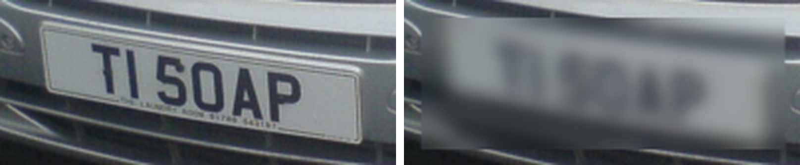
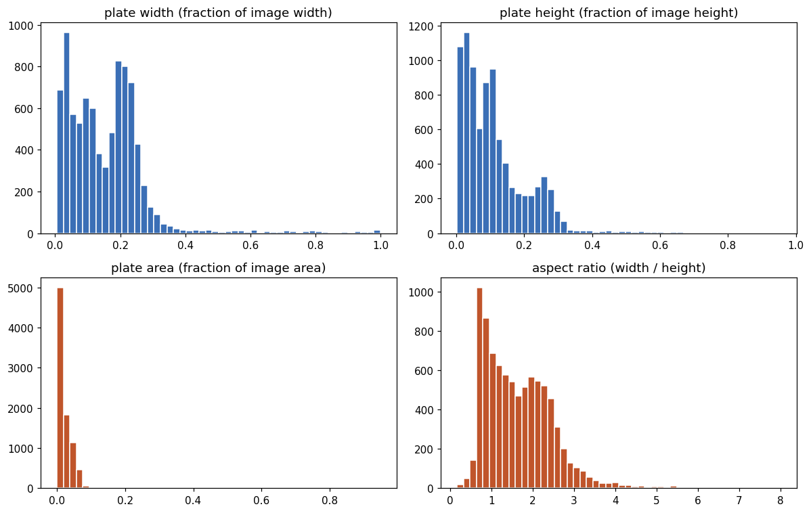
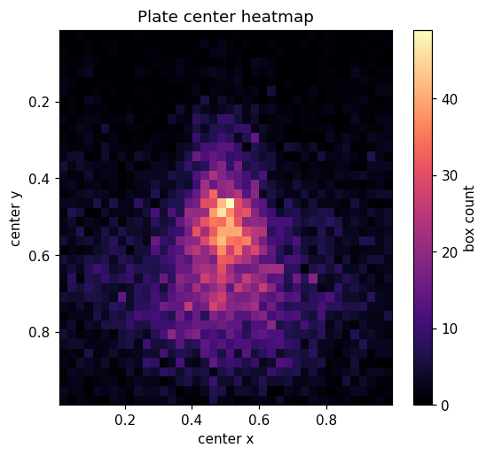
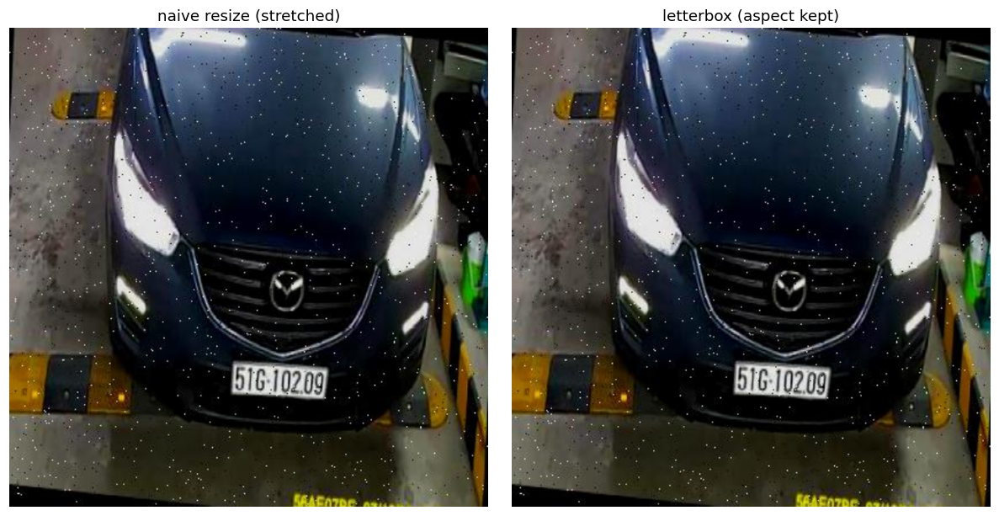
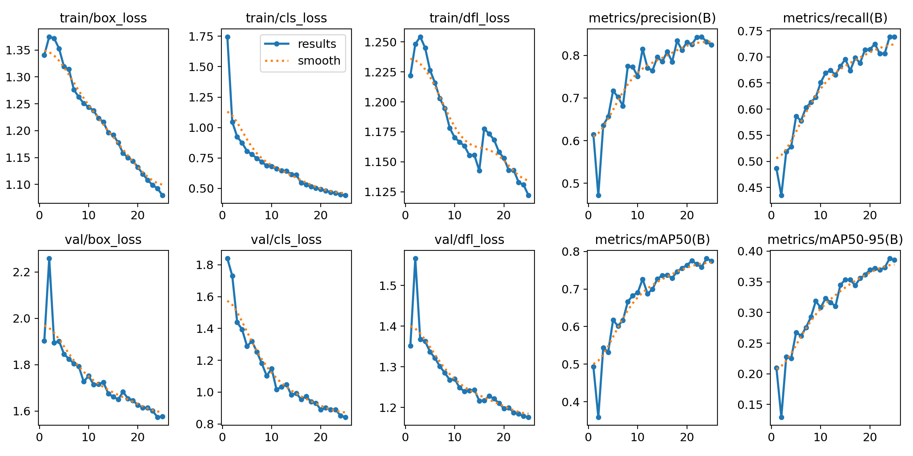
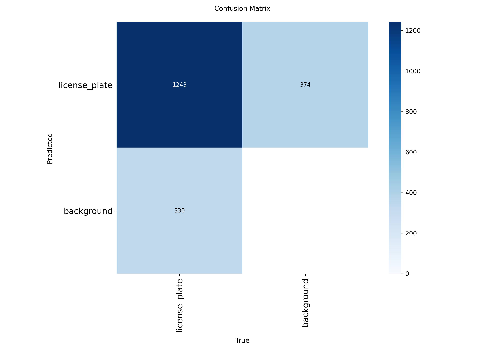

# License Plate Detection and Privacy Blurring with YOLOv8

> **Find every number plate in a street-level image and blur it, while leaving the rest of the scene sharp and useful.** A single-class YOLOv8n detector trained on traffic imagery reaches **mAP@0.5 = 0.78** and **recall = 0.74**, then drives a box-scaled Gaussian blur at roughly **4 ms inference per image**.

On the four test frames published below, EasyOCR recovers nothing from any redacted region, including the two where it cleanly read the plate beforehand. A human eye still resolves the characters on the largest of them. Both results are measured by [`audit/redaction_audit.py`](audit/redaction_audit.py) and saved in [`audit/redaction_audit.txt`](audit/redaction_audit.txt).


**[Read the notebook rendered in nbviewer](https://nbviewer.org/github/Umarfarook1/street-view-plate-blurring/blob/main/notebook.ipynb)**. No clone needed.

## The result first


*Test-set output. For each image the model detects the plate at a recall-friendly confidence of 0.25, then blurs only the pixels inside the detected box (plus a small safety pad). The surrounding scene is untouched, which is exactly what a downstream consumer of this data needs.*

*Two of these frames are worth reading carefully. The taxi is photographed from the side, so its own plate is not visible; what the model found and blurred is a plate on a background car and the fare placard on the taxi door, which EasyOCR reads as `TAXI FARE` before redaction and not at all after. The Hummer has no plate in frame either, and its only detection changes 102 pixels on a background car. Neither frame is a plate on the subject vehicle, so neither is evidence that the pipeline redacts the car you are looking at. The sedan and the van are.*



*The worst case above, magnified 4x. EasyOCR reads `TI SOAP` from the left crop at 0.679 confidence, and from the right crop returns nothing at 1x, 2x and 4x and two junk characters below 0.1 confidence at 8x. The eye does better than the reader: the six glyphs stay separable, so a person can still partly recover the string. Against an off-the-shelf OCR reader this redaction holds. Against a person looking at a large, close, well-lit plate it does not. The Approach section below explains the sizing bug that causes it.*

---

## Problem and why it matters

Traffic cameras, dashcams and street-level imagery are recorded at a scale that was unthinkable a few years ago. The moment a frame contains a readable number plate, it stops being an anonymous picture of a road and becomes personal data. Under GDPR and similar rules a plate is an identifier, and storing or sharing it without a reason is a liability rather than an asset.

The teams that own this data still need it: to train other models, study traffic patterns, settle insurance claims, publish open datasets. None of those uses actually require the plate to be readable. So the goal is narrow and practical - detect every plate and redact the readable part, while leaving the rest of the scene intact.

I treated this as a detection problem followed by a redaction step. Detect the plate with a model fast enough to keep up with video, then blur only the pixels inside the box it returns. The interesting part is not "train a detector"; it is that **the detector is the privacy boundary**. A missed plate is an unblurred plate, so recall is the metric that actually carries risk, and every design choice below leans that way.

## Dataset

- **Source:** a license-plate detection dataset of street and traffic imagery (Roboflow-style export with normalized YOLO labels). The full train split is roughly 25k images; I work from a random **6,000-image** sample plus **1,073 val** and **386 test** images.
- **Why a sample:** the work ran on a free Colab T4. Training off the Drive mount fails outright (the FUSE layer blocks the delete-and-rename YOLO uses to write its label cache, and reading thousands of files over Drive is slow), so the first step copies a sample to local disk in parallel. For a single, low-variety class, 6k images is plenty to train a strong detector in a fraction of the time.
- **Audit, not assumption:** the brief and the approach doc quoted different counts (25,470 / 1,000 / 400 vs 1,073 / 386), so I counted the files myself. The sample is clean: **0 images without a label, 0 labels without an image**, and only **3 empty label files** in 6,000. Total boxes parsed: **8,740**.

What the EDA actually told me, and how it drove the model:



*Plates are small and wide. Mean box area is ~2.8% of the frame and mean aspect ratio is ~1.67. Small wide objects are the case where input resolution matters more than network depth - that single observation drives the resolution-over-depth choices later.*



*Centers are not uniform; they concentrate where vehicles appear. That is reassuring evidence the labels are real and not random noise.*

There is exactly one class (id 0), a mean of **1.17 plates per image** (median 1, max 26), and sampled resolutions run from 416 to 1024 px. One class, low visual variety, mostly one or two instances: this is the textbook argument for a small model at a healthy resolution.

## Approach

The pipeline is detect, then redact. The judgment is in the choices around it.

- **Letterbox to 640, never a naive squash.** A plate might be 40 px wide in a 1080p frame; a careless resize deletes the very characters that distinguish a plate from a grey rectangle, and no model recovers detail removed before it sees the image. I letterbox (resize the long side, pad the short side) so aspect ratio survives. The figure below shows the difference.
- **YOLOv8n (nano), deliberately.** One stage over two stage because the product constraint is keeping up with a video feed at the edge, and the extra accuracy a Faster R-CNN buys on a crowded 80-class scene is wasted on "one plate on a car". Nano over s/m/l/x because a single low-variety class gives a deep backbone nothing to learn - its capacity would sit unused while costing latency every frame. The upgrade path, if recall on distant plates demanded it, is YOLOv8s and a bump to 960 px, in that order. Resolution is my first quality lever, not depth.
- **Augmentations left at the Ultralytics defaults.** The training call passes no augmentation arguments, so the run logged `mosaic=1.0`, `scale=0.5`, `fliplr=0.5`, `flipud=0.0`, `hsv_h=0.015`, `hsv_s=0.7`, `hsv_v=0.4` (printed in the section 9 cell output). Two of those happen to suit the object: scale jitter shows plates at many sizes, and no vertical flip matches plates never being upside down. Saturation jitter at 0.7 is strong for an object whose characters are the whole signal. Tuning these is an open item, not a decision I made.
- **Box-scaled, padded Gaussian blur.** The kernel is a fraction of each box rather than fixed, so it grows with the plate instead of staying constant, and a few-percent pad grows the box before blurring so a slightly tight detection still covers the whole plate. This is the asymmetry made concrete: over-blur is free, under-blur leaks. The sizing has a flaw worth naming. The kernel is `0.40 * min(box_height, box_width)`, and a plate is wider than it is tall (mean aspect 1.67, measured above), so the shorter side is always the height and the kernel stays small next to the gap between characters along the width. That is why the largest plate in the figure comes through with its glyphs still separable. Sizing the kernel on the longer side, or switching to pixelation or a solid fill, is the fix. It needs a re-run, so it has not shipped.



*Letterbox (right) keeps the plate looking like a plate. Naive resize (left) distorts it into a shape the model never sees at inference.*

## Results

Trained from COCO-pretrained `yolov8n.pt` for **25 epochs** at **640 px**, batch 16, seed 42, on a single Tesla T4. Validation on the held-out 1,073-image val split:

| Metric | Value | Why it is here |
|---|---:|---|
| **mAP@0.5** | **0.782** | Primary localization quality |
| mAP@0.5:0.95 | 0.390 | Strict-IoU quality; harder bar |
| Precision | 0.834 | False positives = harmless extra blur |
| **Recall** | **0.739** | The metric that carries privacy risk |
| Inference speed | ~4.1 ms/img | T4, real-time-capable |
| Model size | 3.0M params, 8.1 GFLOPs | Fits an edge/camera deployment |

These numbers print themselves at the end of the notebook from the live validation object, so there is nothing hand-filled. (See `notebook.ipynb`, sections 10 and 12.)



*All losses are still trending down and every metric is still climbing at epoch 25. The model is not saturated - there is clear headroom from more epochs, more data, or a larger variant.*



*Confusion matrix for the one-class problem. The visible leakage is plate-vs-background: the false-negative cell is the one that matters for privacy, since a plate scored as background goes through unblurred.*

**What this means:** for a short, sampled run this is a genuinely usable detector - precision 0.83 means few spurious blurs, and mAP@0.5 of 0.78 means it localizes well at the threshold that matters. The honest weak spot is recall at 0.74: roughly one in four plate instances is missed at the strict measure, and for a privacy tool every miss is a potential leak. That is precisely why inference runs at a recall-friendly confidence (0.25) and the blur box carries a pad - I would rather over-blur than let a readable plate slip through. The low mAP@0.5:0.95 (0.39) reflects looser box tightness under the sampled, 25-epoch budget, not a localization failure at the operating IoU.

## How to run

This is a self-contained Colab notebook. There is no hidden state - run it top to bottom.

1. Open `notebook.ipynb` in Google Colab.
2. `Runtime > Change runtime type > T4 GPU`.
3. Add the dataset folder to your Drive, mount it, and point `DATASET_DIR` (section 3) at the dataset root (the folder holding `images/` and `labels/`).
4. `Runtime > Run all`. End to end is roughly an hour including the parallel copy and training.

Locally you can install the same dependencies and run the notebook with Jupyter:

```bash
pip install -r requirements.txt
jupyter lab notebook.ipynb
```

Key knobs, all near the top of their sections (no magic numbers buried in code):

```python
TRAIN_CAP = 6000   # random sample size for a fast, reliable run
EPOCHS    = 25
IMGSZ     = 640    # raise to 960 before going to a bigger model
BATCH     = 16
FRACTION  = 1.0    # set 0.5 to roughly halve the run
# seeds fixed: random.seed(42), np.random.seed(42), train seed=42
```

## Auditing the redaction

Section 11 of the notebook holds an OCR check that runs EasyOCR on a plate crop before and after blurring. It is **off** in the committed run: `RUN_OCR_CHECK` is `False` and the saved output reads `OCR check skipped`. Set it to `True` to run it against full-resolution pipeline output, which needs the dataset and the trained weights.

Because neither ships with the repo, there is a second audit that needs no GPU, no dataset and no weights. It runs against the figure this README publishes, so anyone who clones the repo can reproduce every claim above:

```bash
pip install easyocr pillow numpy
python audit/redaction_audit.py
```

For each of the four frames it diffs the original panel against the redacted one to show exactly which pixels the blur touched, then runs EasyOCR on both panels and on the redacted region alone at 1x, 2x, 4x and 8x with recall-friendly thresholds, which is what someone trying to recover the text would do. Saved output is in [`audit/redaction_audit.txt`](audit/redaction_audit.txt). The summary:

| Frame | Redaction lands on | OCR before | OCR after |
|---|---|---|---|
| sedan | its own plate (5,796 px) | `C63` 0.999, `AMG` 0.989 | nothing at any scale |
| taxi | background car + door placard (3,303 px) | `TAXI FARE` 0.263 | nothing at any scale |
| hummer | background car only (102 px) | nothing | nothing |
| van | its own plate (12,738 px) | `TI SOAP` 0.679 | nothing to 4x, junk < 0.1 at 8x |

This audits the published figure, not the full-resolution pipeline output, and it does not measure what a human can still read. On the van a human can read most of the plate. That gap between "an OCR reader gets nothing" and "the text is gone" is the honest state of this redaction.

## Repo structure

```
.
├── notebook.ipynb                    # the whole pipeline: audit -> EDA -> train -> eval -> blur
├── license-plate-blurring-report.pdf # printed write-up of the original Colab run
├── audit/
│   ├── redaction_audit.py            # OCR + pixel-diff audit of the published figure
│   └── redaction_audit.txt           # its saved output
├── assets/                           # committed figures used in this README
├── data/                             # gitignored; see "How to run" to fetch the dataset
├── requirements.txt
└── README.md
```

The PDF is a print of the original run and still carries the wording this README has since corrected, in particular a heading claiming the OCR check proves the text is gone when the check was never switched on. Re-exporting it needs a full re-run. Treat the README and `audit/` as current and the PDF as a record of the training run.

## Key takeaways

- **Verify labels before spending a GPU hour.** Section 7 overlays boxes on raw images. If the coordinate convention were wrong, training loss would still fall while the model quietly learned the wrong thing. A five-second visual check defends an hour of compute.
- **Let the data pick the model.** Small, wide, single-class, low-variety plates argue for a small network at high resolution. That is why nano at 640 was the principled choice, not the reflex of a big model at a low resolution.
- **Optimize the privacy boundary for recall.** Over-blurring is free; under-blurring is the entire risk. The recall-friendly threshold and the box pad both exist to push false negatives toward zero.
- **Anonymize at the source.** Because YOLOv8n is tiny and exports cleanly to ONNX or TensorRT, the right deployment is to blur on the camera or edge box before an image is ever stored, shrinking the legal surface and cutting bandwidth.
- **Check the redaction, do not assume it.** The blur looked convincing until it was measured. It defeats EasyOCR on all four frames and still leaves a large plate readable by eye, and only one of those two facts was in this README before the audit was written. A privacy tool that publishes its own worst case is worth more than one that asserts a clean result.
- **These numbers are a faithful floor, not a ceiling.** They come from a 6k sample and a 25-epoch schedule sized for a free T4. The curves are still descending. The honest next steps before deployment: a full-data run at YOLOv8s, a real test-set evaluation, a kernel sized on the longer box side, and the section 11 OCR check run against full-resolution output on a held-out sample.

## License

MIT. See `LICENSE`.
